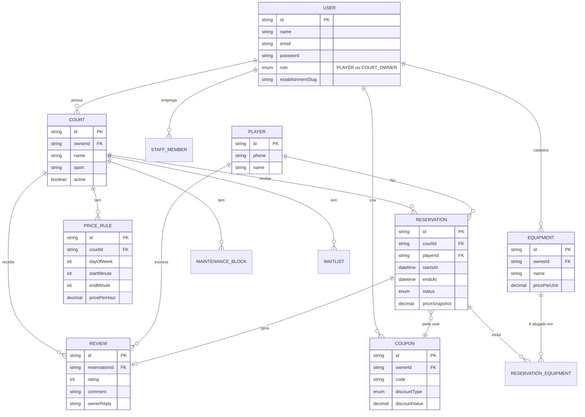

# Entrega 01 — Jogaê Sports

**Disciplina:** Programação Web
**Data:** 14/09/2026
**Repositório:** https://github.com/jogaesports26/jogae-sports
**Sistema em produção:** https://jogae-sports-frontend.vercel.app/ (frontend) · https://jogae-sports-backend.onrender.com (API)

Este documento cobre, item a item, o checklist da 1ª entrega. Detalhes mais aprofundados (arquitetura, modelo de dados completo, roadmap) estão em [docs/DOCUMENTACAO.md](docs/DOCUMENTACAO.md).

---

## 1. Repositório no GitHub

Repositório: [jogaesports26/jogae-sports](https://github.com/jogaesports26/jogae-sports), organização `jogaesports26` no GitHub, compartilhado com todos os integrantes da equipe. Histórico de commits público, com Pull Requests revisadas antes de cada merge em `main`.

## 2. Definição da stack tecnológica

| Camada | Tecnologia |
|---|---|
| Front-end | React 19 + Vite + TypeScript, `react-router-dom` para rotas, CSS puro (sem framework de UI) |
| Back-end | NestJS 11 (Node.js), autenticação JWT própria (`@nestjs/jwt`) |
| Banco de dados | PostgreSQL (hospedado no Supabase), acessado via Prisma ORM 6.9 |
| Hospedagem | Frontend na Vercel · Backend no Render · Banco no Supabase (todos free tier nesta fase) |

Monorepo com `npm workspaces` (`apps/backend`, `apps/frontend`).

## 3. Estrutura inicial do projeto

```
jogae-sports/
├── apps/
│   ├── backend/     → NestJS + Prisma (API REST)
│   │   ├── prisma/schema.prisma   → modelo de dados
│   │   └── src/                   → módulos (auth, courts, reservations, coupons, ...)
│   └── frontend/    → React + Vite
│       └── src/
│           ├── pages/       → telas (landing, login, painel do dono, portal do cliente)
│           ├── components/  → layout/painel/portal
│           └── lib/         → chamadas de API e utilitários
├── docs/            → documentação do projeto
├── render.yaml      → config de deploy do backend
└── package.json     → scripts do monorepo
```

## 4. Descrição breve do sistema

**Jogaê Sports** é um sistema SaaS de gestão para donos de quadras esportivas (arenas de futebol, quadras de tênis, vôlei de praia etc.). Cada estabelecimento tem seu próprio espaço no sistema para cadastrar quadras, preços, horários e equipe — e uma "lojinha" pública (`jogae.com/<nome-do-estabelecimento>`) onde jogadores reservam horários online, sem depender de WhatsApp ou planilhas.

**Objetivo:** substituir o controle manual de agenda/reservas (WhatsApp, papel, planilha) por um painel de gestão completo, ao mesmo tempo em que dá ao jogador uma forma simples de encontrar horário livre e reservar.

**Público-alvo:**
- **Donos de quadras/arenas esportivas** (usuário pagante) — precisam de agenda, controle financeiro, CRM de clientes e ferramentas comerciais (cupons, equipamentos).
- **Jogadores** (usuário final) — precisam encontrar e reservar horário de forma rápida, sem cadastro complicado (login por telefone).

## 5. Requisitos funcionais

Mínimo de 5 pedido pelo professor — o sistema hoje já implementa muito mais que isso. Principais:

1. **Cadastro e login do dono do estabelecimento** (com e-mail/senha, recuperação de senha por token).
2. **Cadastro e gestão de quadras** (esporte, tipo de piso, iluminação, fotos, ativa/inativa).
3. **Definição de preços por quadra, dia da semana e faixa de horário** (`PriceRule`).
4. **Agenda e reserva de horários** com verificação de conflito, tanto pelo dono/funcionário quanto pelo jogador (login por telefone) ou convidado (nome/telefone avulso).
5. **Reagendamento e cancelamento de reservas**, respeitando janela mínima de antecedência.
6. **Bloqueio de manutenção** (pontual e recorrente) para tirar horários de circulação.
7. **Lista de espera** quando o horário desejado está ocupado.
8. **Cupons de desconto** (percentual ou fixo, com validade e limite de uso) aplicados na reserva.
9. **Aluguel de equipamentos** avulsos somados ao valor da reserva.
10. **Avaliações de jogadores** com resposta pública do dono.
11. **Funcionários com permissão limitada** (agenda apenas vs. gestão completa).
12. **Relatórios financeiros e comerciais** (faturamento por período, ocupação, cupom/equipamento mais usado, exportação CSV).
13. **Portal público por estabelecimento** (lojinha com slug próprio, filtro por esporte, favoritos, widget incorporável via `<iframe>`).

O detalhamento técnico de cada um está em [docs/DOCUMENTACAO.md](docs/DOCUMENTACAO.md).

## 6. Modelagem inicial do banco de dados (DER)

Modelo completo em [apps/backend/prisma/schema.prisma](apps/backend/prisma/schema.prisma) (16 entidades). Abaixo, o núcleo do domínio (bem mais que as 3 entidades mínimas pedidas):



*(o GitHub renderiza este diagrama Mermaid automaticamente ao abrir este arquivo no repositório)*

## 7. Protótipo das principais telas

O sistema já está em produção, então em vez de wireframes estáticos usamos o próprio produto rodando como protótipo. Telas principais (mínimo de 3 pedido pelo professor):

1. **Landing page** — apresentação do produto para o dono de quadra: https://jogae-sports-frontend.vercel.app/
2. **Login / Cadastro do dono** (com alternância "Sou dono" / "Sou funcionário"): https://jogae-sports-frontend.vercel.app/login e https://jogae-sports-frontend.vercel.app/cadastro
3. **Lojinha pública de um estabelecimento** (portal do jogador, dados de demonstração): https://jogae-sports-frontend.vercel.app/arena-vitoria
4. **Painel do dono** (agenda, relatórios, clientes etc.) — requer login; usar a conta de demonstração `contato@arenavitoria.test` / `Seed@123` (ver [docs/DOCUMENTACAO.md](docs/DOCUMENTACAO.md) para as demais contas de teste).

> Para anexar prints estáticos ao PDF/slides da entrega, é só tirar screenshot dessas URLs — o sistema já está com dados de demonstração carregados (4 estabelecimentos fictícios).

## 8. Sistema com estrutura inicial funcionando

Confirmado — não é só a estrutura inicial, o sistema está em produção com navegação completa entre landing page, autenticação, painel do dono (mais de 15 telas) e portal público do jogador:

- Frontend: https://jogae-sports-frontend.vercel.app/ (Vercel)
- Backend/API: https://jogae-sports-backend.onrender.com (Render — instância free "dorme" após inatividade, primeira requisição pode levar ~50s)
- Banco: PostgreSQL no Supabase, com dados de demonstração (4 estabelecimentos, quadras, reservas, avaliações)

## 9. Evidência de participação da equipe

- **GitHub**: histórico de commits e Pull Requests em https://github.com/jogaesports26/jogae-sports/pulls — cada funcionalidade nova segue o fluxo branch → PR → revisão → merge em `main`.
- **Trello**: quadro de acompanhamento em https://trello.com/b/f2dEOaPL/jogae-sports com listas de backlog, em progresso e concluído.

---

## Valor de entrega (impacto no negócio)

Além de cumprir o checklist acadêmico, vale registrar o que essa entrega representa para o **Jogaê Sports como produto/negócio** (o projeto foi desenhado desde o início para ser um SaaS real, não só um exercício de disciplina):

- **Cobertura de MVP muito além do mínimo pedido**: uma "Entrega 01" típica normalmente entrega só o esqueleto do sistema. Aqui já existem ~13 requisitos funcionais completos e testados (agenda, reservas, pagamentos calculados, CRM, cupons, equipamentos, equipe com permissão, relatórios, portal público) — ou seja, o produto já tem o núcleo de um MVP comercializável, não apenas uma prova de conceito.
- **Risco técnico já reduzido**: as três decisões mais caras de reverter depois — escolha de stack, modelo de dados e hospedagem — já estão validadas em produção real (não em ambiente local), incluindo o pipeline de deploy (Vercel + Render + Supabase) funcionando de ponta a ponta.
- **Validação de mercado antecipada**: a pesquisa de concorrentes (ver [docs/DOCUMENTACAO.md](docs/DOCUMENTACAO.md)) mostrou que concorrentes no modelo marketplace (Agendei, Minha Quadra, WebQuadras) estão com aparência de abandonados, enquanto o único concorrente com tração real (SAQES, 2000+ estabelecimentos) usa o mesmo modelo SaaS escolhido aqui — a entrega já nasce alinhada com o que comprovadamente funciona nesse mercado.
- **Dado de demonstração pronto para vender a ideia**: os 4 estabelecimentos fictícios com dados realistas (reservas passadas/futuras, avaliações, cupons) permitem demonstrar o produto para um dono de quadra real hoje, sem esperar a entrega final da disciplina.

**Estimativa qualitativa**: considerando o escopo típico de um MVP de SaaS de agendamento (autenticação multi-tenant, agenda com regras de preço, pagamento calculado, CRM básico e portal do cliente), o sistema atual já cobre a maior parte desse escopo. Isso é uma estimativa de esforço/cobertura de produto para planejamento interno da equipe — não uma avaliação financeira formal do negócio.
