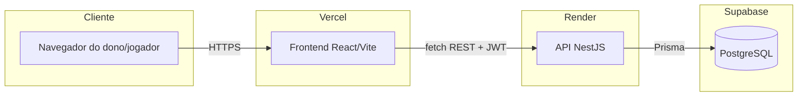

# Documentação do Projeto — Jogaê Sports

> Documentação técnica e de produto do Jogaê Sports. Para o documento voltado à 1ª entrega da disciplina, veja [ENTREGA-01.md](../ENTREGA-01.md).

## Sumário

1. [Visão geral](#1-visão-geral)
2. [Equipe](#2-equipe)
3. [Stack tecnológica](#3-stack-tecnológica)
4. [Arquitetura](#4-arquitetura)
5. [Modelo de dados](#5-modelo-de-dados)
6. [Funcionalidades implementadas](#6-funcionalidades-implementadas)
7. [Como rodar o projeto localmente](#7-como-rodar-o-projeto-localmente)
8. [Ambientes e hospedagem](#8-ambientes-e-hospedagem)
9. [Fluxo de trabalho da equipe](#9-fluxo-de-trabalho-da-equipe)
10. [Roadmap](#10-roadmap)

---

## 1. Visão geral

Jogaê Sports é um sistema de gestão para locação de quadras esportivas, no modelo **SaaS** (Software as a Service): cada estabelecimento (arena, clube, quadra avulsa) tem seu próprio espaço isolado no sistema para cadastrar quadras, preços, horários, equipe e clientes, além de uma página pública própria para jogadores reservarem horários online.

**Por que SaaS e não marketplace:** uma pesquisa de concorrentes mostrou que sistemas no modelo marketplace (Agendei, Minha Quadra, WebQuadras — um catálogo único que lista quadras de vários donos) parecem abandonados hoje. O único concorrente com tração real (SAQES, 2000+ estabelecimentos ativos) usa o modelo SaaS puro. Por isso o Jogaê Sports prioriza funcionalidades de gestão por estabelecimento (agenda, CRM, financeiro) em vez de um checkout multi-vendedor.

**Público-alvo:**
- Donos/gestores de quadras esportivas (cliente pagante).
- Jogadores que buscam e reservam horário (usuário final, sem custo).

## 2. Equipe

| Integrante | Frente |
|---|---|
| Raziel Rodrigues | Back-end |
| Melquedesque | Front-end |
| Stephany | Suporte / UX |

Entregas obrigatórias semanais (às segundas-feiras, dia de aula da disciplina). Acompanhamento de tarefas no Trello: https://trello.com/b/f2dEOaPL/jogae-sports

## 3. Stack tecnológica

**Back-end**
- [NestJS](https://nestjs.com/) 11 (Node.js) — framework modular sobre Express
- [Prisma ORM](https://www.prisma.io/) 6.9 — acesso tipado ao banco, migrations
- Autenticação: JWT "na mão" via `@nestjs/jwt` (sem Passport), com `JwtAuthGuard` + `RolesGuard` + decorators `@Roles()`/`@CurrentUser()`

**Front-end**
- [React](https://react.dev/) 19 + [Vite](https://vitejs.dev/) + TypeScript
- `react-router-dom` 7 para roteamento
- CSS puro (sem biblioteca de componentes/state manager) — tokens de design em `apps/frontend/src/index.css` e primitivos reutilizáveis (`.btn`, `.card`, `.pill`, `.modal`) em `apps/frontend/src/styles/primitives.css`

**Banco de dados**
- PostgreSQL, hospedado no [Supabase](https://supabase.com/)

**Infraestrutura**
- Monorepo com `npm workspaces` (`apps/backend`, `apps/frontend`)
- Frontend hospedado na [Vercel](https://vercel.com/) (free tier)
- Backend hospedado no [Render](https://render.com/) (free tier, via `render.yaml`)
- Banco no Supabase (free tier)
- Fase futura: migração para VPS própria quando o projeto crescer/monetizar

## 4. Arquitetura



O frontend é uma SPA que fala com o backend por uma API REST (JSON), autenticada por JWT guardado no `localStorage`. Não há SSR nem BFF — o React chama a API diretamente via helpers em `apps/frontend/src/lib/*.ts`.

**Papéis de usuário (roles) hoje:**
- `COURT_OWNER` — dono do estabelecimento, acesso completo ao painel.
- `STAFF` — funcionário vinculado a um dono, com permissão `MANAGE_RESERVATIONS` (agenda/reservas) ou `VIEW_ONLY` (somente leitura); autenticado separadamente em `/staff-auth/login`.
- `PLAYER` — jogador, autenticado por telefone + código OTP (sem senha).

## 5. Modelo de dados

Schema completo em [`apps/backend/prisma/schema.prisma`](../apps/backend/prisma/schema.prisma). Principais entidades:

| Entidade | Responsabilidade |
|---|---|
| `User` | Dono do estabelecimento (perfil, dados da "lojinha": slug, descrição, comodidades) |
| `Court` | Quadra (esporte, piso, iluminação, fotos) |
| `PriceRule` | Preço por quadra/dia da semana/faixa de horário |
| `Reservation` | Reserva feita por jogador ou convidado, com status e preço congelado (`priceSnapshot`) |
| `Player` | Jogador identificado por telefone |
| `Review` | Avaliação do jogador sobre a quadra, com resposta opcional do dono |
| `Waitlist` | Fila de espera para horário ocupado |
| `MaintenanceBlock` / `RecurringMaintenanceBlock` | Bloqueio de horário pontual/recorrente |
| `Instructor` | Professor/instrutor vinculável a uma reserva |
| `Coupon` | Cupom de desconto (percentual/fixo) |
| `Equipment` / `ReservationEquipment` | Equipamento alugável e seu vínculo com uma reserva |
| `StaffMember` | Funcionário com login e permissão próprios |
| `PasswordResetToken` / `OtpCode` | Tokens de recuperação de senha e login por OTP |

Ver o DER visual (núcleo do domínio) em [ENTREGA-01.md](../ENTREGA-01.md#6-modelagem-inicial-do-banco-de-dados-der).

## 6. Funcionalidades implementadas

O sistema já passou por várias ondas de desenvolvimento além do escopo mínimo da disciplina (histórico completo de PRs em https://github.com/jogaesports26/jogae-sports/pulls). Resumo por área:

**Autenticação e acesso**
- Cadastro/login do dono, recuperação de senha
- Login por telefone + OTP para jogador
- Funcionários com permissão limitada (agenda vs. somente leitura)

**Gestão da quadra (painel do dono)**
- CRUD de quadras (esporte, piso, iluminação, fotos)
- Regras de preço por dia/horário
- Agenda com criação/edição/cancelamento/reagendamento de reservas
- Bloqueio de manutenção pontual e recorrente
- Fila de espera

**Comercial**
- Cupons de desconto (percentual/fixo, validade, limite de uso)
- Aluguel de equipamentos avulsos
- Relatórios financeiros (faturamento, ocupação) e comerciais (cupom/equipamento mais usados), com exportação CSV

**CRM**
- Perfil de cliente com histórico de reservas
- Clientes inativos, aniversariantes do mês, alerta de falta recorrente (no-show)

**Portal do jogador (lojinha pública por estabelecimento)**
- Página pública por slug (`/<estabelecimento>`), com "sobre", fotos e comodidades
- Fluxo de reserva em duas etapas (seleção de dia/horário → confirmação)
- Avaliações com resposta do estabelecimento
- Favoritar quadra, filtrar por esporte, convidar amigo (Web Share API), adicionar ao Google Calendar
- Comprovante de reserva, QR code da lojinha para imprimir
- Widget incorporável via `<iframe>` (`/<estabelecimento>/embed`)

**Dados de demonstração**: script `apps/backend/prisma/seed.ts` popula 4 estabelecimentos fictícios (futebol, tênis, vôlei de praia, multiesportivo) com quadras, reservas, avaliações, cupons e equipamentos — usado para testes e demonstração. Credenciais de teste documentadas internamente pela equipe.

## 7. Como rodar o projeto localmente

Na raiz do repositório:

```bash
npm install
```

Backend:

```bash
cp apps/backend/.env.example apps/backend/.env
# preencher DATABASE_URL / DIRECT_URL do PostgreSQL no .env
cd apps/backend
npx prisma generate
npx prisma migrate dev --name init
cd ../..
npm run dev:backend
```

Frontend:

```bash
npm run dev:frontend
```

Frontend sobe em `http://localhost:5173`, backend em `http://localhost:3000` (configurável via `VITE_API_URL` no `.env.local` do frontend).

## 8. Ambientes e hospedagem

| Ambiente | URL |
|---|---|
| Frontend (produção) | https://jogae-sports-frontend.vercel.app/ |
| Backend/API (produção) | https://jogae-sports-backend.onrender.com |
| Banco de dados | PostgreSQL gerenciado no Supabase |

A instância free do Render "dorme" após um período de inatividade — a primeira requisição após ficar ocioso pode levar dezenas de segundos.

## 9. Fluxo de trabalho da equipe

- Cada integrante clona o repositório e roda localmente com seu próprio `.env`, apontando para o mesmo banco Supabase compartilhado.
- Trabalho sempre em branch (`git checkout -b feature/nome`), nunca direto em `main`.
- Push da branch → Pull Request → revisão da equipe → merge em `main`.
- Por uma particularidade do plano gratuito da Vercel (times Hobby bloqueiam deploy se o autor do commit de merge não for colaborador do projeto), o merge final de cada PR é feito pelo Raziel logado como a conta `jogaesports26`.
- Planejamento e histórico de tarefas no Trello: https://trello.com/b/f2dEOaPL/jogae-sports

## 10. Roadmap

Próximas ondas de funcionalidades já planejadas (não fazem parte do escopo mínimo da disciplina, mas orientam o desenvolvimento contínuo do produto):

- **Widget/admin da plataforma**: painel interno (fora do painel do dono) para a equipe Jogaê Sports acompanhar todos os estabelecimentos cadastrados.
- **Fidelidade por pontos**: acúmulo de pontos por reserva concluída, com regra de resgate a definir.
- **Notificações reais**: hoje o sistema já dispara os eventos (reserva confirmada, lembrete, cancelamento) em modo de desenvolvimento (loga a mensagem); falta integrar um provedor real de SMS/WhatsApp/e-mail (ex: Twilio, Z-API, Resend).

Fora de escopo por decisão deliberada da equipe (não fazem sentido para o modelo de produto atual): reserva recorrente automática tipo "aula fixa" e suporte a múltiplas unidades/filiais por dono (o modelo atual é "um dono = uma arena").
